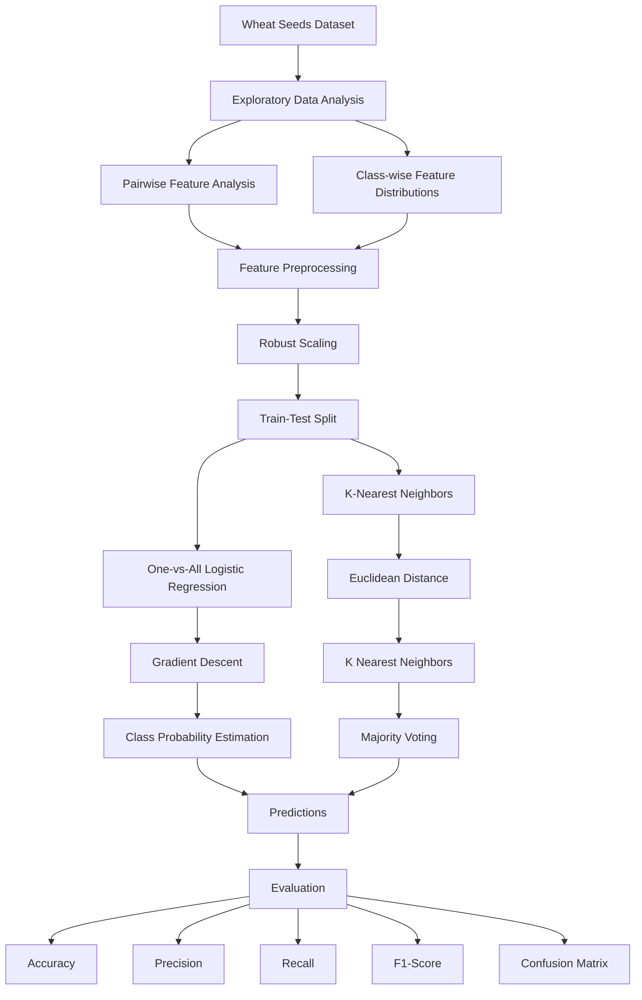

<div align="center">


</div>

# Classification from Scratch with Logistic Regression and KNN on Wheat Seeds

This project implements a complete multiclass wheat seeds classification pipeline from scratch using **One-vs-All Logistic Regression** and **K-Nearest Neighbors (KNN)**. The workflow includes exploratory data analysis, robust feature scaling, custom train-test splitting, gradient-descent-based logistic regression, distance-based KNN classification, and evaluation using accuracy, precision, recall, F1-score, and confusion matrices.

<div align="left">

[](https://www.python.org/)

[](https://numpy.org/)

[](https://pandas.pydata.org/)

[](https://matplotlib.org/)

[](https://seaborn.pydata.org/)

[](#)

[](#)

[](#)

[](https://www.kaggle.com/datasets/jmcaro/wheat-seedsuci)

[](https://opensource.org/licenses/MIT)

</div>

## Abstract

This project presents a from-scratch implementation of classical machine learning techniques for **multiclass wheat seeds classification**. The workflow is developed around the Wheat Seeds dataset and focuses on understanding the underlying algorithms rather than relying on ready-made classification implementations.

The pipeline begins with exploratory analysis of the seed features through pairwise scatter plots and class-wise feature distributions. The numerical features are then normalized using **Robust Scaling**, based on the median and interquartile range (IQR), to reduce the influence of feature scale and potential outliers.

Two classification approaches are implemented manually:

1. **One-vs-All Logistic Regression**, trained with gradient descent and a sigmoid activation function.
2. **K-Nearest Neighbors (KNN)** using Euclidean distance and majority voting.

The project also includes custom implementations of train-test splitting and classification evaluation metrics, providing an end-to-end view of the classification process without relying on high-level machine learning classifiers.

## Table of Contents

1. [Overview](#-overview)
2. [Key Features](#-key-features)
3. [Project Workflow](#-project-workflow)
4. [Methodology](#-methodology)

   * [Exploratory Data Analysis](#-exploratory-data-analysis)
   * [Robust Feature Scaling](#-robust-feature-scaling)
   * [One-vs-All Logistic Regression](#-one-vs-all-logistic-regression)
   * [K-Nearest Neighbors](#-k-nearest-neighbors)
   * [Evaluation](#-evaluation)
5. [Experimental Setup](#-experimental-setup)
6. [Dataset](#-dataset)
7. [Repository Structure](#-repository-structure)
8. [Installation](#-installation)
9. [Usage](#-usage)
10. [Technologies Used](#-technologies-used)
11. [Author](#author)
12. [Support](#-support)
13. [License](#license)

# Overview

The goal of this project is to build a transparent machine learning pipeline for distinguishing between different wheat seed classes using their measured physical characteristics.

Rather than using pre-built implementations such as `sklearn.linear_model.LogisticRegression` or `sklearn.neighbors.KNeighborsClassifier`, the core learning algorithms are implemented manually with NumPy.

The project covers the complete workflow:

* Exploratory analysis of wheat seed features
* Pairwise feature visualization
* Class-wise feature distribution analysis
* Robust feature normalization using median and IQR
* Custom train-test splitting
* Multiclass One-vs-All Logistic Regression
* Gradient-descent optimization
* Custom KNN classifier
* Euclidean distance computation
* Hyperparameter analysis for different K values
* Accuracy, precision, recall, and F1-score evaluation
* Confusion matrix generation
* Repeated experiments with and without a fixed random seed

# Key Features

* From-scratch implementation of Logistic Regression
* Multiclass classification using the One-vs-All strategy
* Gradient descent optimization without a machine learning framework
* From-scratch KNN implementation
* Euclidean distance-based neighborhood classification
* Robust Scaling using median and interquartile range
* Custom train-test splitting
* Manual implementation of evaluation metrics
* Confusion matrix computation
* Class-wise exploratory data analysis
* Pairwise feature visualization
* K-value analysis for KNN
* Reproducible experiments using a fixed random seed
* Comparison between seeded and non-seeded train-test splits

# Project Workflow

The overall workflow consists of data exploration, preprocessing, model training, and evaluation.



# Methodology

## Exploratory Data Analysis

The dataset is initially explored through visual analysis to understand the relationships and distributions of the seed features.

Two complementary visualization strategies are used:

### Pairwise Feature Analysis

A pairplot is generated to visualize pairwise relationships between numerical features while differentiating the three wheat seed classes.

This provides an initial view of:

* Feature correlations
* Class separability
* Overlapping regions between classes
* Potentially informative features

### Class-wise Feature Distributions

Histograms with kernel density estimates are generated separately for each class to examine how individual features are distributed across the three seed categories.

This analysis helps identify differences in feature distributions and potential overlap between classes.

---

## Robust Feature Scaling

Before classification, the numerical features are normalized using a custom **Robust Scaling** implementation.

For each feature, the transformation is defined as:

$$
x' = \frac{x - \text{median}(x)}{IQR(x)}
$$

where:

$$
IQR = Q_3 - Q_1
$$

The median and interquartile range are calculated directly using NumPy.

This scaling approach is particularly useful when feature magnitudes differ or when the data may contain observations that could disproportionately affect mean- and standard-deviation-based normalization.

---

## One-vs-All Logistic Regression

Because the Wheat Seeds dataset contains three classes, Logistic Regression is extended to multiclass classification using the **One-vs-All (OvA)** strategy.

Three binary classifiers are trained:

* Class 1 vs. all other classes
* Class 2 vs. all other classes
* Class 3 vs. all other classes

For each binary classifier, the sigmoid function is used:

$$
\sigma(z) = \frac{1}{1 + e^{-z}}
$$

The model parameters are optimized using gradient descent.

The gradient is calculated as:

$$
\nabla_\theta =
\frac{1}{m}X^T(h-y)
$$

and the parameters are updated according to:

$$
\theta := \theta - \alpha \nabla_\theta
$$

where:

* $m$ is the number of training samples
* $\alpha$ is the learning rate
* $h$ represents the predicted probabilities
* $y$ represents the binary target labels

For multiclass prediction, the class associated with the highest predicted probability is selected.

### Configuration

| Parameter               |            Value |
| :----------------------- | :---------------: |
| Classification Strategy |       One-vs-All |
| Optimization            | Gradient Descent |
| Iterations              |             1000 |
| Learning Rate           |             0.01 |
| Number of Classes       |                3 |
| Test Ratio              |              20% |
| Random Seed             |               42 |

---

## K-Nearest Neighbors

The second classifier is a custom implementation of **K-Nearest Neighbors (KNN)**.

For each test sample, the Euclidean distance to every training sample is calculated:

$$
d(x_i,x_j)=
\sqrt{\sum_{k=1}^{n}(x_{ik}-x_{jk})^2}
$$

The training samples are then sorted according to their distance from the test point. The labels of the nearest $K$ samples are selected, and the most frequent class is used as the prediction.

The implementation evaluates:

$$
K \in \{1,2,\ldots,10\}
$$

and records the classification accuracy for every value of $K$.

The accuracy-versus-$K$ curve is then visualized to analyze how the neighborhood size affects classification performance.

---

## Evaluation

The project implements the main classification metrics manually rather than relying on a high-level evaluation library.

### Accuracy

$$
Accuracy =
\frac{Correct\ Predictions}{Total\ Predictions}
$$

### Precision

For each class:

$$
Precision =
\frac{TP}{TP+FP}
$$

### Recall

For each class:

$$
Recall =
\frac{TP}{TP+FN}
$$

### F1-Score

$$
F1 =
2\frac{Precision \times Recall}
{Precision + Recall}
$$

### Confusion Matrix

A custom confusion matrix implementation is also provided to analyze class-level prediction errors and identify which wheat seed categories are most frequently confused with one another.

# Experimental Setup

The main experiment uses an 80/20 train-test split.

The primary Logistic Regression experiment uses a fixed random seed of `42` to make the split reproducible.

A second experiment repeats the train-test splitting process without explicitly setting a random seed, allowing the effect of different random partitions to be observed.

The Logistic Regression configuration is:

| Component           | Configuration                  |
| :------------------- | :------------------------------ |
| Training/Test Split | 80% / 20%                      |
| Feature Scaling     | Robust Scaling                 |
| Classifier          | One-vs-All Logistic Regression |
| Optimization        | Gradient Descent               |
| Learning Rate       | 0.01                           |
| Iterations          | 1000                           |
| Random Seed         | 42                             |

For KNN, values of $K$ from `1` to `10` are evaluated on the test set.

# Dataset

The project uses the **Wheat Seeds dataset**, a multiclass dataset containing measurements of wheat seeds belonging to three different seed varieties.

The input features describe physical characteristics of the seeds, while `Type` is used as the target class.

The dataset is available through Kaggle:

**Wheat Seeds Dataset:**
https://www.kaggle.com/datasets/jmcaro/wheat-seedsuci

### Dataset Features

The implementation uses the numerical seed measurements as input variables and `Type` as the target label.

The classification task is therefore formulated as:

```text
Seed Features
      ↓
Robust Scaling
      ↓
Multiclass Classification
      ↓
Type ∈ {1, 2, 3}
```

# Repository Structure

```text

Logistic-Regression-and-KNN-Classification-on-Wheat_Seeds/
│
├── Wheat_Seeds_Classification_from_Scratch.ipynb
│
├── LICENSE
│
└── README.md
```

# Installation

## Clone Repository

```bash
git clone https://github.com/ParmidaGh/Logistic-Regression-and-KNN-Classification-on-Wheat_Seeds.git

cd Logistic-Regression-and-KNN-Classification-on-Wheat_Seeds
```

## Create Environment

```bash
conda create -n wheat-seed-classification python=3.10

conda activate wheat-seed-classification
```

## Install Dependencies

```bash
pip install numpy pandas matplotlib seaborn
```

# Usage

Open the notebook:

```bash
jupyter notebook Wheat_Seeds_Classification_from_Scratch.ipynb
```

Then execute the cells sequentially.

The notebook covers:

1. Dataset loading
2. Exploratory visualization
3. Feature normalization
4. Train-test splitting
5. One-vs-All Logistic Regression
6. Logistic Regression evaluation
7. KNN classification
8. K-value analysis
9. Evaluation of the non-seeded experiment

# Technologies Used

| Category                | Tools                    |
| :----------------------- | :------------------------ |
| Programming Language    | Python                   |
| Numerical Computing     | NumPy                    |
| Data Processing         | Pandas                   |
| Visualization           | Matplotlib, Seaborn      |
| Classification          | Logistic Regression, KNN |
| Optimization            | Gradient Descent         |
| Dataset                 | Wheat Seeds Dataset      |
| Development Environment | Jupyter Notebook         |

# Author

**Parmida Ghamari**

Research Assistant @ Social Networks Lab

**Research Interests:** Machine Learning, Deep Learning, Graph Neural Networks, Natural Language Processing, Large Language Models (LLMs), Representation Learning, Self-Supervised Learning, and Intelligent Systems

📧 [Parmida.ghamari@gmail.com](mailto:Parmida.ghamari@gmail.com)
💻 [github.com/ParmidaGh](https://github.com/ParmidaGh)
💼 [www.linkedin.com/in/parmida-ghamari](https://www.linkedin.com/in/parmida-ghamari)

# ⭐ Support

If you find this project useful, consider giving it a star ⭐

# License

This project is licensed under the MIT License.

---

<p align="center">
Built using Python, NumPy, Pandas, Matplotlib, and Seaborn
</p>
